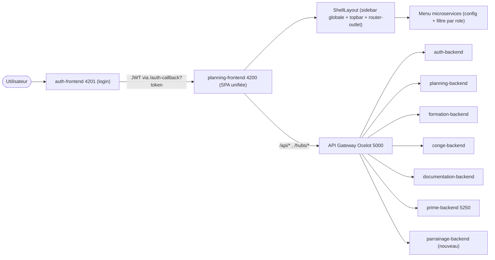

# Assemblage de l'application unifiée Kyntus

## Objectif
Une seule SPA (`projet_kyntus_service_planning-frontend`, port 4200) qui héberge tous les modules en lazy-loading. `auth-frontend` (4201) reste dédié au login/JWT. Après connexion, l'utilisateur voit un **menu latéral global listant les microservices**, chacun dépliant son **sous-menu détaillé**, filtré **par rôle**. Style repris du **module Prime**.

## Architecture cible

## Pré-requis (à ta charge)
- Copier les dossiers `PrimeBackend/` et le module **Parrainage** (backend) à la racine du workspace.
- Copier les écrans/feature Angular Prime et Parrainage dans `projet_kyntus_service_planning-frontend/src/app/features/prime` et `.../parrainage`.
- Première étape du dev: **inventaire** des modules copiés (préfixes d'API réels, rôles, routes Angular) — le plan utilise des placeholders `/api/prime`, `/api/parrainage` à ajuster.

## 1. Shell unifié + menu latéral global (front)
Aujourd'hui la sidebar est embarquée uniquement dans [dashboard-home.html](projet_kyntus_service_planning-frontend/src/app/features/dashboard/pages/dashboard-home/dashboard-home.html) et `dashboard-employee` gère ses vues en interne. Il n'existe pas de shell persistant.

- Créer `features/shell/shell-layout.component.{ts,html,css}`: sidebar gauche persistante (groupes = microservices, accordéon dépliable) + topbar (cloche notif, user, logout) + `<router-outlet>`.
- Créer `core/navigation/microservices.config.ts`: tableau typé des microservices `{ id, label, icon, allowedRoles, children: [{ label, route, allowedRoles }] }` couvrant: Organisation, Ressources Humaines, Planification, Congés, Formation, Documentation, Réclamations, **Prime**, **Parrainage**.
- Filtrage par rôle dans la sidebar via [AuthService.getRole()](projet_kyntus_service_planning-frontend/src/app/core/services/auth.service.ts) (n'afficher que les groupes/items autorisés).

## 2. Restructuration du routage (front)
Dans [app.routes.ts](projet_kyntus_service_planning-frontend/src/app/app.routes.ts):
- Envelopper toutes les routes fonctionnelles comme **enfants** d'une route parente `ShellLayoutComponent` (le menu reste affiché en naviguant entre modules).
- Garder hors-shell: `auth-callback`, `unauthorized`.
- Ajouter routes lazy `prime` et `parrainage` (avec `canActivate: [AuthGuard]` + `data.roles`).
- Remplacer la home par une page d'accueil "lanceur" dans le shell (grille des microservices), ou rediriger vers le 1er module autorisé via [RedirectService](projet_kyntus_service_planning-frontend/src/app/core/services/redirect.service.ts).

## 3. Intégration features Prime & Parrainage (front)
- Brancher les feature-modules/routes copiés sous `features/prime` et `features/parrainage`.
- Adapter les services HTTP pour viser le gateway: `/api/prime/...`, `/api/parrainage/...` (passer par l'intercepteur/headers existants comme la feature `documentation`).

## 4. Style "module Prime" global
- Extraire les tokens/variables CSS du module Prime copié vers un `styles.css` global (ou `core/styles/_theme.css`).
- Appliquer au `ShellLayout` et harmoniser progressivement les features existantes (sidebar, topbar, cartes) sur ce thème.

## 5. API Gateway (Ocelot)
Dans [ocelot.gateway.json](init/ocelot.gateway.json), ajouter les routes (sur le modèle des paires existantes `/api/x` + `/api/x/{everything}`):
- `/api/prime` et `/api/prime/{everything}` -> `Host: prime-backend:8080`.
- `/api/parrainage` et `/api/parrainage/{everything}` -> `Host: parrainage-backend:8080`.
- Éventuels hubs SignalR Prime/Parrainage si présents.

## 6. docker-compose + bases
Dans [docker-compose.yml](docker-compose.yml):
- `prime-backend` existe déjà (vérifier que `./PrimeBackend` est bien recopié; bootstrap `prime-db-bootstrap` + [init/sql/prime_database.sql](init/sql/prime_database.sql) déjà présents).
- Ajouter `parrainage-db-bootstrap` (création `parrainage_db` + SQL `init/sql/parrainage_database.sql`) et `parrainage-backend` (port ex. 5260, `ASPNETCORE_URLS=http://+:8080`, connection string dédiée).
- Ajouter `prime-backend` et `parrainage-backend` aux `depends_on` de `api-gateway`.

## 7. Authentification & rôles unifiés
- Recenser les rôles attendus par Prime/Parrainage (les contrôleurs Prime supprimés référençaient RBAC/Supervisor/Pilote, etc.).
- Vérifier que ces rôles existent côté `auth-backend` (claims JWT) et les refléter dans `data.roles` des routes + `allowedRoles` de `microservices.config.ts`.
- L'`AuthGuard` reste la barrière par route; le menu ne fait que masquer les entrées non autorisées.

## Vérification (manuelle, terminal non disponible ici)
- `npm install` + `ng build` du front, puis `docker compose up --build` pour valider gateway + nouveaux backends et le rendu du menu par rôle.

## Hypothèses
- Prime et Parrainage exposent une API REST derrière le gateway (préfixes à confirmer à l'inventaire).
- Les rôles existants (Admin, RH, Manager, Coach, RP, Pilote, Audit, Equipe_Formation, Employee) sont la base; ajouts éventuels selon Prime/Parrainage.