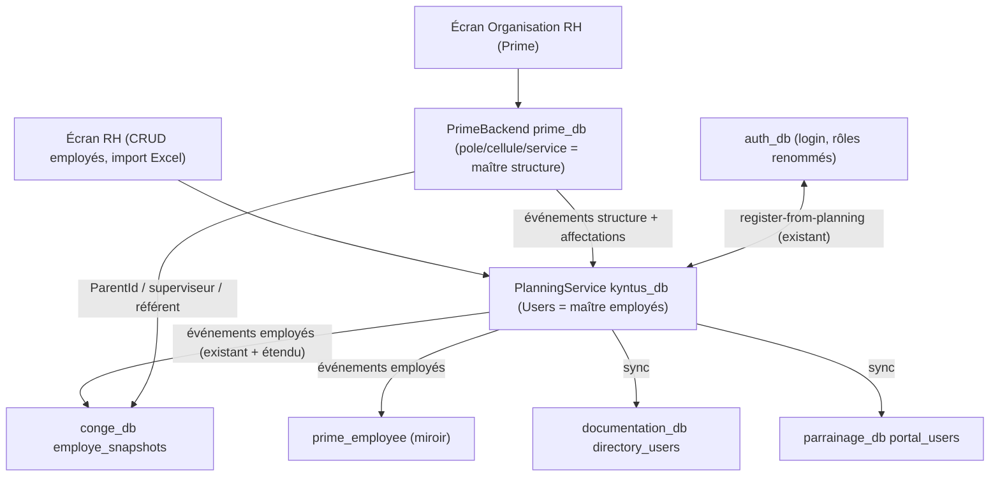

# Unification de la hiérarchie sur le modèle Prime

## Principe directeur

- **Structure organisationnelle (maître)** : module Prime — `Pôle → Cellule → Service`, gérée dans l'écran « Organisation RH » ([organisation-management.component.ts](projet_kyntus_service_planning-frontend/src/app/features/prime/pages/organisation-management.component.ts), backend [PrimeBackend/Data/PrimeEntities.cs](PrimeBackend/Data/PrimeEntities.cs)).
- **Employés (maître)** : écran RH existant ([features/users](projet_kyntus_service_planning-frontend/src/app/features/users/users-module.ts), backend [PlanningService/Models/User.cs](PlanningService/PlanningService/Models/User.cs)) — conserve import Excel, sync Auth, sync Congé.
- **Les autres services** (Congé, Documentation, Parrainage, Prime lui-même pour les employés) deviennent des **miroirs synchronisés**, jamais des sources.

## Table d'équivalences officielle

Structure (les tables Planning restent, seuls la sémantique et les libellés changent) :
- `Floor` (Étage) = **Pôle** (miroir de `prime_pole`)
- `Service` (Planning) = **Cellule** (miroir de `prime_cellule`)
- `SubService` = **Service** (miroir de `prime_service`) — les plannings restent accrochés à ce niveau, rien ne change pour la génération

Rôles (renommage, décision utilisateur) :
- `Employee` → **Pilote**
- `Coach` → **Référent technique** (1 ou plusieurs par service)
- `RP` → **Chef de projet** (1 ou plusieurs par pôle)
- `Manager` → **Superviseur** (1 ou plusieurs par cellule) — **uniquement pour Planning et Congé**. Dans **Prime, Parrainage et Documentation, le rôle « Manager » garde son nom** ; l'équivalence est documentée et gérée par la couche de mapping ([kyntus-role-ui.config.ts](projet_kyntus_service_planning-frontend/src/app/core/session/kyntus-role-ui.config.ts)) : JWT `Superviseur` ≡ `Manager` (Documentation) ≡ `MANAGER` (Parrainage)
- `RH`, `Admin`, `Audit`, `Equipe formation`, `Comptabilité` : inchangés (rôles transverses)
- Côté Auth : **les deux rôles coexistent** — `Superviseur` (9) = responsable hiérarchique de cellule ; `Manager` (3) = rôle transverse conservé pour Prime (pool de validation global), Documentation et Parrainage. Les utilisateurs actuellement « Manager » au sens hiérarchique Planning migrent du rôle 3 vers le rôle 9

Identité : clé de corrélation = **email** (déjà utilisée par Prime/Parrainage) + `SubjectId` Auth ; `User.Guid` Planning devient l'ID employé inter-services.

## Architecture cible

## Phase 1 — Renommage global des rôles (atomique, tous services)

- **SQL migrations** (un script par base, livrées ensemble) :
  - `auth_db.Roles` : renommer 1→Pilote, 4→Référent technique, 5→Chef de projet ; **conserver le rôle 3 « Manager »** (transverse Prime/Doc/Parrainage) et le rôle 9 « Superviseur » ; migrer les utilisateurs « Manager » au sens hiérarchique Planning du rôle 3 vers le rôle 9 ([AuthService/Program.cs](AuthService/AuthService/Program.cs) seed à aligner).
  - `kyntus_db.Roles` : renommer Employee→Pilote, Coach→Référent technique, RP→Chef de projet, Manager→Superviseur (le rôle hiérarchique Planning devient Superviseur) ([DockerComposePlanningDemoSeed.cs](PlanningService/PlanningService/Data/DockerComposePlanningDemoSeed.cs)).
  - `conge_db.employe_snapshots.role` : UPDATE des chaînes (`Manager`→`Superviseur`, `Employee`→`Pilote`, ...).
- **Code — comparaisons de chaînes de rôles** :
  - Planning : `UserService.cs` (dérivation validateur `Role.Name == "Manager"` → `"Superviseur"`), `NewsletterService.cs` (corriger au passage le bug `"MANAGER"`/`"EMPLOYEE"` en majuscules, cibler les nouveaux noms).
  - Congé : [Demandercongehandler.cs](FormationService/Conge.Application/Commands/DemanderConge/Demandercongehandler.cs) (`"Manager"` → `"Superviseur"`).
  - Prime : **aucun renommage interne** — le rôle transverse `Manager` et les rôles `Superviseur`/`Référent technique`/`Chef de projet`/`Pilote` existent déjà ; simplifier seulement `ExpandRole` dans [PrimeRequestUserResolver.cs](PrimeBackend/Services/PrimeRequestUserResolver.cs) (les alias rp/coach/employee pointent vers les noms officiels).
  - Documentation : **enum `AppRole` inchangé pour `Manager`** ([DomainEnums.cs](documentation_service_backend/DocumentationBackend/Data/DomainEnums.cs)) ; seuls les rôles JWT entrants sont mappés (`Superviseur`→`Manager`, `Référent technique`→`Coach`, `Chef de projet`→`Rp`, `Pilote`→`Pilote`) dans la résolution d'identité gateway/headers.
  - Parrainage : **rôles internes `MANAGER`/`COACH`/`RP`/`PILOTE` inchangés** ; mise à jour du mapping JWT→rôle portail dans [ParrainageRequestUserResolver.cs](parrainage_service_backend/Services/ParrainageRequestUserResolver.cs) pour reconnaître les nouveaux noms (`Superviseur`→`MANAGER`, etc.).
  - Frontend : [kyntus-role-ui.config.ts](projet_kyntus_service_planning-frontend/src/app/core/session/kyntus-role-ui.config.ts) devient la **table d'équivalence unique** (JWT → rôle par module) ; [roles.model.ts](projet_kyntus_service_planning-frontend/src/app/core/models/roles.model.ts), guards `app.routes.ts` et libellés UI mis à jour pour Planning/Congé/Users uniquement ; les features prime, documentation et parrainage gardent leurs libellés « Manager ».
- Le JWT portant le nom du rôle, **tout doit partir dans la même release** ; prévoir reconnexion des utilisateurs.

## Phase 2 — Structure : Prime devient maître, Planning miroir

- Ajouter colonnes de corrélation dans `kyntus_db` : `Floors.PrimePoleId`, `Services.PrimeCelluleId`, `SubServices.PrimeServiceId` (migration EF Planning).
- **PrimeBackend publie** (MassTransit/RabbitMQ, infra déjà présente) : `OrgNodeCreated/Renamed` + `OrgAssignmentChanged` lors des POST `structure/*` ([PrimeControllers.cs](PrimeBackend/Controllers/PrimeControllers.cs)).
- **PlanningService consomme** : upsert des miroirs Floor/Service/SubService (codes générés depuis l'ID Prime). Script de rattrapage initial (réconciliation par nom) pour l'existant.
- Les controllers Planning `FloorController`, `ServicesController`, `SubServicesController` : POST/PUT/DELETE désactivés (lecture seule) ; les écrans frontend `features/floors`, `features/services`, `features/sub-services` passent en lecture seule avec libellés Pôle/Cellule/Service et lien « Gérer dans Organisation RH ».
- **Assouplissement de la cardinalité (décision utilisateur) : 1 ou plusieurs responsables par nœud** :
  - Supprimer la règle « 1 max » dans [OrgStructureRules.cs](PrimeBackend/Services/OrgStructureRules.cs) et la logique de rétrogradation automatique de l'ancien responsable dans `PrimeInMemoryStore` (`SetManagerForDepartment`, `SetSupervisorForPole`, `SetCoachForCellule` deviennent additifs, avec DELETE explicite par personne). Le modèle de données le permet déjà (plusieurs `prime_employee` avec le même rôle et la même ancre `PoleId`/`CelluleId`/`ServiceId`).
  - Les listes d'affectation dérivées (`RebuildOrgAssignmentsFromEmployees`) et les endpoints `assignments/*` retournent naturellement plusieurs lignes par nœud — vérifier que les consommateurs (scopes, drill-downs) gèrent les listes.
  - UI « Organisation RH » : la colonne « Chef de projet actuel » (et équivalents superviseur/référent) devient une liste avec ajout/retrait par personne au lieu d'un remplacement.
  - `ParentId` des Pilotes : si plusieurs Référents techniques sur un service, le référent de rattachement est choisi lors de l'affectation du pilote (défaut : premier référent du service) — même règle pour Référent→Superviseur et Superviseur→Chef de projet.
- L'écran « Organisation RH » Prime reste fonctionnellement identique par ailleurs ; ajouter le DELETE/rename de nœuds plus tard si besoin (hors périmètre).

## Phase 3 — Employés : flux unique RH → tous les services

- **Écran RH** : le champ « sous-service » devient « Service » (équivalence) ; la liste des rôles affiche les nouveaux noms ; la section « Hiérarchie gérée » (`managedSubServiceIds`/`managedServiceIds`) est remplacée par l'affectation Prime (lecture seule ici, modifiable dans Organisation RH).
- **PlanningService étend sa publication existante** ([EmployePublisher.cs](PlanningService/PlanningService/Messaging/Publishers/EmployePublisher.cs)) : message employé enrichi (Guid, email, rôle renommé, PrimeServiceId résolu via le miroir).
- **PrimeBackend consomme** : upsert `prime_employee` (Id = `User.Guid`, Email, Role, ServiceId/CelluleId/PoleId déduits, ParentId recalculé par les règles existantes [OrgStructureRules.cs](PrimeBackend/Services/OrgStructureRules.cs)). Suppression du seed démo employés (`Prime__SeedDemoData`, `EnrichDemoData` → false) après migration.
- **Migration de réconciliation** : matcher `prime_employee` ↔ `Users` Planning par email ; rapport des orphelins (employés Prime sans compte Planning → créés côté Planning ; doublons → fusionnés). Grâce à la cardinalité assouplie (plusieurs responsables par nœud), les anciens « Managers » Planning migrent sans conflit ; seul cas restant à arbitrer : un même responsable couvrant plusieurs cellules/services (l'ancre `CelluleId`/`ServiceId` de `prime_employee` est unique par personne) — listé dans le rapport.
- Congé : corriger le consumer qui force `role = "Employee"` et alimenter `ManagerId` = superviseur réel (ParentId Prime) au lieu du manager dérivé Planning — le workflow de validation congés reste identique fonctionnellement (l'employé est validé par son supérieur, le Superviseur par RH/Admin).

## Phase 4 — Consommateurs de hiérarchie alignés

- **Documentation** : `directory_users` (`managerId`/`coachId`/`rpId`/`poleId`/`celluleId`) alimenté par une sync depuis Prime (remplace le seed SQL statique [documentation_insert_kyntus_directory_users.sql](init/sql/documentation_insert_kyntus_directory_users.sql)) ; correspondance par SubjectId/email. **Les noms de champs et de rôles Documentation restent inchangés** — équivalence documentée : `managerId` ≡ Superviseur Prime, `coachId` ≡ Référent technique, `rpId` ≡ Chef de projet.
- **Parrainage** : supprimer la hiérarchie statique en dur ([OrgHierarchy.cs](parrainage_service_backend/Services/OrgHierarchy.cs)) et les seeds `ParentId` ; `parrainage_portal_user.ParentId` synchronisé depuis le `ParentId` Prime (par email).
- **Formation** : aucun changement structurel (pas de hiérarchie) — seulement les libellés de rôles côté UI.
- **Frontend** : `org-assignment.service.ts`, `hierarchyDrillDown.ts`, `documentation-org-hierarchy.ts`, `parrainage/lib/scoping.ts` restent fonctionnels (mêmes endpoints) ; vérifier que les drill-downs utilisent les nouveaux noms de rôles.

## Phase 5 — Vocabulaire UI et plannings

- Renommer les libellés dans le frontend unifié : « Étage »→« Pôle », « Service »→« Cellule », « Sous-service »→« Service » (features floors/services/sub-services/users/planning). Routes et clés techniques inchangées (pas de casse).
- **Plannings : zéro changement de logique** — `WeeklyPlanning` reste lié au `SubServiceId` (désormais miroir d'un Service Prime), génération, shifts, groupes samedi, congés locaux, contrats : intacts. Seuls les libellés des sélecteurs changent.
- Les endpoints legacy Prime (`/org/etages` = pôles, `/org/services` = cellules) sont conservés tels quels pour ne rien casser ; documentation du mapping dans le code.

## Phase 6 — Nettoyage et vérification

- Désactiver les seeds démo redondants (Prime employés, enrichissement Bogus) ; aligner les seeds restants sur les nouveaux noms de rôles.
- Script de vérification croisée : comptages employés par base, correspondance emails Planning↔Prime↔Auth, chaîne hiérarchique complète (chaque Pilote a un Référent → Superviseur → Chef de projet).
- Tests de bout en bout : création employé RH → visible dans Prime/Congé ; affectation superviseur dans Organisation RH → validation congé par ce superviseur ; génération d'un planning ; scopes Prime (saisie cellule, validation) ; parrainage et documentation avec les nouveaux rôles.

## Risques identifiés

- Renommage des rôles dans le JWT : déploiement atomique obligatoire de tous les services + frontends.
- Cardinalité : la règle « 1 responsable max par nœud » est supprimée (1 ou plusieurs). Limite résiduelle : une personne ne peut être ancrée que sur une seule cellule / un seul service (`prime_employee.CelluleId`/`ServiceId` mono-valué) — les cas multi-nœuds existants côté Planning sont listés dans le rapport de réconciliation.
- Workflows aval (validation congé, scopes Prime) : avec plusieurs superviseurs/référents possibles, le validateur reste déterminé par le `ParentId` de l'employé (rattachement explicite), pas par le nœud — comportement à vérifier dans les tests de bout en bout.
- Le système de noms Prime API est trompeur (`etages`/`services`/`sous-services`) : ne pas y toucher, mais le documenter.